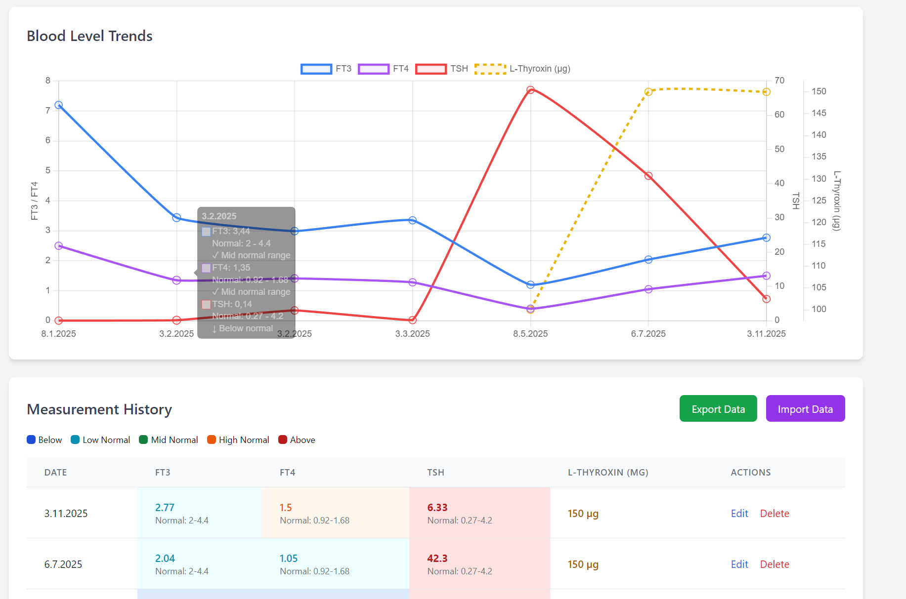

# Thyroid Blood Level Tracker

<p align="center">
  
</p>

A simple, privacy-focused web application for tracking and visualizing thyroid blood test results over time. All data is stored locally in your browser - no server, no accounts, complete privacy.

🔗 **[Live Demo](https://kolstr.github.io/thyroid-level-tracker/)**



## Features

### 📊 Track Key Thyroid Markers

- **FT3** (Free Triiodothyronine)
- **FT4** (Free Thyroxine)
- **TSH** (Thyroid Stimulating Hormone)
- **L-Thyroxin dosage** (optional medication tracking for hypothyroidism)
- **Thyreostatica dosage** (optional medication tracking for hyperthyroidism - e.g., Methimazole, Carbimazole)

### 📈 Visual Analytics

- Interactive charts showing trends over time
- Color-coded values indicating:
  - Below normal range (blue)
  - Low normal range (cyan)
  - Mid normal range (green)
  - High normal range (orange)
  - Above normal range (red)
- Multiple Y-axes for different measurement scales
- Hover tooltips with detailed range information

### ⚙️ Customizable Normal Ranges

- Configure your own normal ranges for each marker
- Save custom ranges for personalized tracking
- Reset to default values anytime
- Ranges persist across sessions

### 💾 Data Management

- **Export**: Download all your data as JSON (backup or transfer)
- **Import**: Restore data from previously exported files
- **Share**: Generate a link to share your data with others (e.g., your doctor)
- **Merge or Replace**: Choose how to handle existing data when importing
- **Edit/Delete**: Modify or remove individual measurements

### 🔒 Privacy First

- All data stored locally in browser localStorage
- No server-side storage or accounts required
- No data leaves your device
- Works completely offline after initial load

### 📱 Progressive Web App (PWA)

- **Install as App**: Add to your home screen on iOS and Android
- **Offline Support**: Works without internet connection after installation
- **Native Feel**: Runs like a native mobile app in standalone mode
- **Quick Access**: Launch directly from your device's home screen

#### Installing on Mobile:

- **iOS (Safari)**: Tap Share → "Add to Home Screen"
- **Android (Chrome)**: Tap Menu (⋮) → "Install app" or "Add to Home screen"

## Usage

### Adding Measurements

1. Enter the date of your blood test
2. Input your FT3, FT4, and TSH values
3. Optionally add your L-Thyroxin dosage (for hypothyroidism treatment)
4. Optionally add your Thyreostatica dosage (for hyperthyroidism treatment - e.g., Methimazole, Carbimazole)
5. Click "Add Measurement"

### Configuring Normal Ranges

1. Click "Show/Hide" in the Normal Ranges Configuration section
2. Enter your lab's reference ranges for each marker
3. Click "Update Ranges" to save

### Exporting Your Data

1. Click the "Export Data" button in the Measurement History section
2. A JSON file will be downloaded to your computer
3. Keep this file as a backup or to transfer data between devices/browsers

### Importing Data

1. Click the "Import Data" button
2. Select a previously exported JSON file
3. Choose to merge with existing data or replace all data
4. Optionally import custom normal ranges from the file

### Editing/Deleting Measurements

- Click "Edit" next to any measurement to modify it
- Click "Delete" to remove a measurement (with confirmation)

### Sharing Your Data

1. Click the "Share" button in the Measurement History section
2. A shareable link containing all your data will be copied to your clipboard
3. Send this link to anyone (e.g., your doctor) to let them view your data
4. Recipients can view the data without it being saved to their device

## Technical Details

- **Pure HTML/CSS/JavaScript** - No build process required
- **Chart.js** for interactive visualizations
- **Tailwind CSS** for responsive design
- **localStorage API** for persistent data storage

## Browser Compatibility

Works in all modern browsers that support:

- localStorage
- ES6 JavaScript
- HTML5

## Installation

### Option 1: Use Online

Simply visit [https://kolstr.github.io/thyroid-level-tracker/](https://kolstr.github.io/thyroid-level-tracker/)

### Option 2: Run Locally

1. Clone the repository:
   ```bash
   git clone https://github.com/kolstr/thyroid-level-tracker.git
   ```
2. Open `docs/index.html` in your web browser

That's it! No installation, no dependencies, no build process.

## Data Format

Exported JSON files contain:

```json
{
  "version": "1.0",
  "exportDate": "2025-11-06T12:00:00.000Z",
  "normalRanges": {
    "ft3": { "min": 2, "max": 4.4, "unit": "" },
    "ft4": { "min": 0.92, "max": 1.68, "unit": "" },
    "tsh": { "min": 0.27, "max": 4.2, "unit": "" }
  },
  "measurements": [
    {
      "timestamp": "2025-11-06",
      "ft3": 3.2,
      "ft4": 1.4,
      "tsh": 2.1,
      "lthyroxin": 100,
      "thyreostatica": 5
    }
  ]
}
```

## Contributing

Contributions are welcome! Feel free to:

- Report bugs
- Suggest features
- Submit pull requests

## License

This project is open source and available under the MIT License.

## Disclaimer

This tool is for personal tracking purposes only and is not a substitute for professional medical advice. Always consult with your healthcare provider regarding your thyroid health and treatment.
